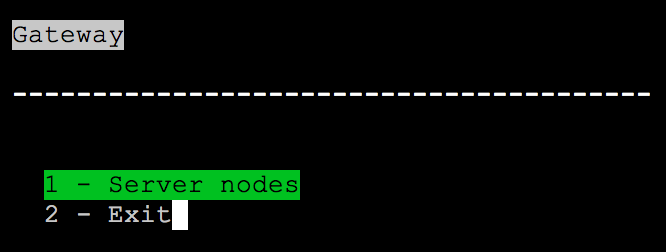

[](https://imagelayers.io/?images=bbania/ssh-gateway:latest 'Get your own badge on imagelayers.io')

# SSH Gateway

A simple Python SSH menu in a Docker container.



## Configuration

* Pull the image from Docker Registry:
```
docker pull bbania/ssh-gateway
```
* Create an SSH key with
```
ssh-keygen -t rsa -b 4096 -C <your_comment>
```
* Create `ssh_config` file with list of your hosts.
  * File format:
```
Host node1
  IdentityFile ~/.ssh/id_rsa
  HostName my.host.ip
  User user
  Port 22
```

* Edit menu.py `menu_data` to set menu entries for your hosts
  * Format:
    * **title** - provides menu title
    * **subtitle** - additional title for menu
    * **type** (takes either `MENU` or `COMMAND` values):
      * **MENU** - creates a menu entity (requires `subtitle` to be set as well as `options` for submenu)
      * **COMMAND** - executes a shell command


Example menu_data in menu.py.

* Add the ssh key to remote hosts.

## Running container

Pass ssh key and ssh_config to the container as volumes:

```
docker run --rm -it \
  -v /path/to/ssh_config:/etc/ssh/ssh_config \
  -v /path/to/ssh-key:/root/.ssh/id_rsa \
  bbania/ssh-gateway
```

